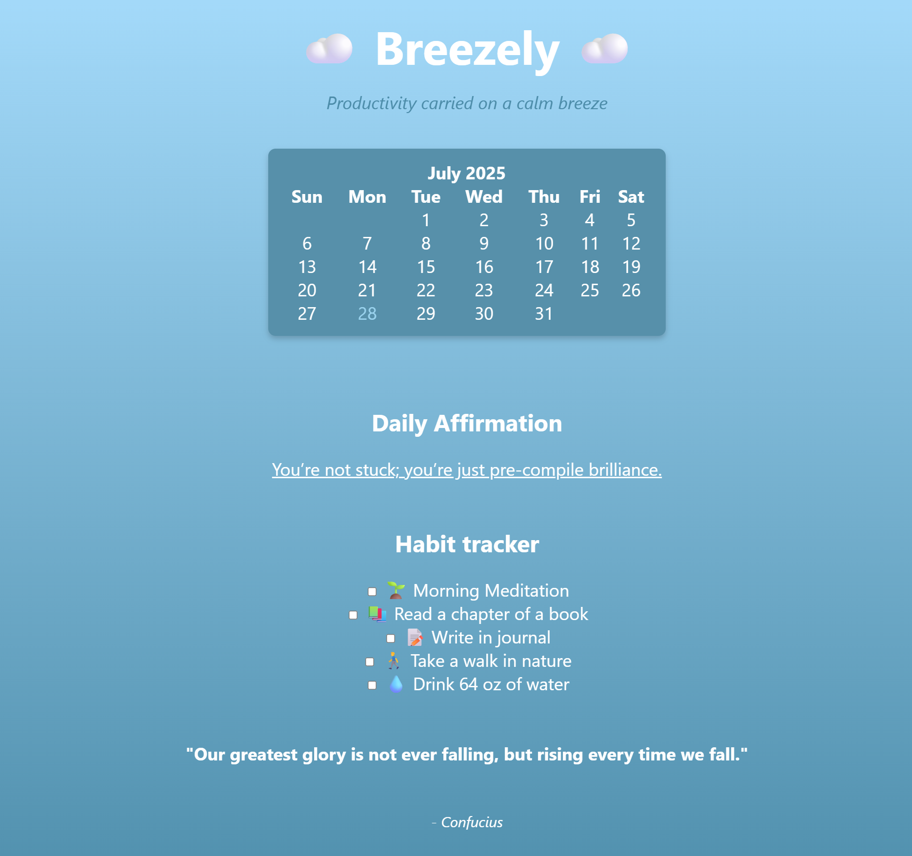

# ☁️ Breezely — productivity carried on a calm breeze
A small but powerful wellness and productivity app crafted by Python, Flask, and the drive for wellness!

---

## 🚀 Features
- Check and uncheck your daily habits in the Habit Tracker section!
- See what day it is with the live calendar!
- Refresh the page to get a randomized daily affirmation!

---

## 🧠 Technologies Used
- Python 3.11
- Flask 2.3.2
- HTML & CSS

---

## 🖼️ Demo


---

## 🛠️ Setup Instructions
```bash
# Clone the repo
git clone https://github.com/BiancaSauceda/python-project.git

# Move into the project
cd python-project

# Install dependencies
pip install -r requirements.txt

# Run the Flask app
python main.py
